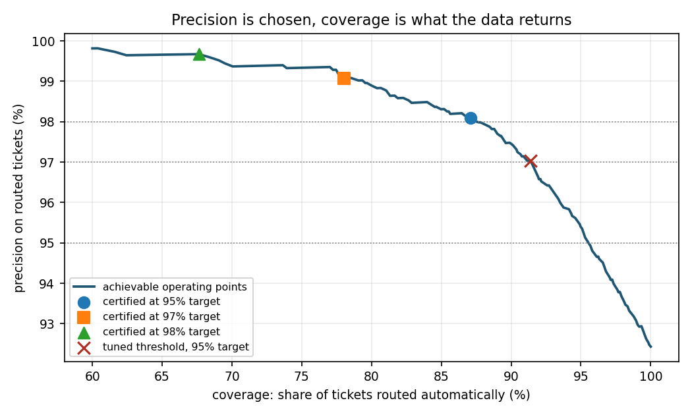
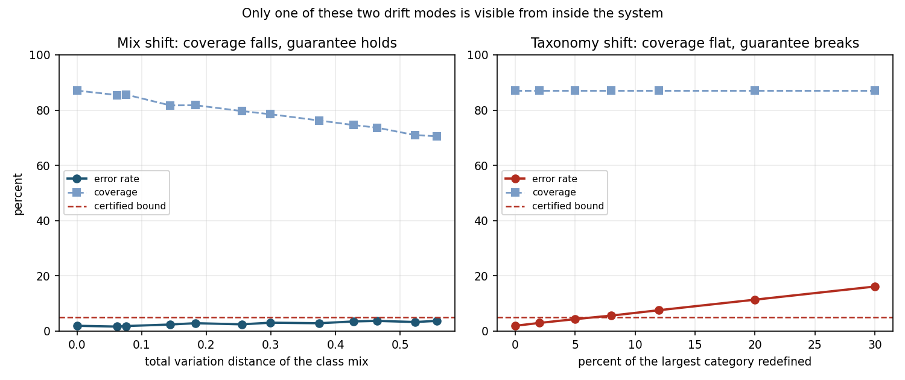

# Selective ticket routing: a measurement harness

**What this is.** A working implementation of the threshold-setting mechanism proposed for a Service Desk ticket classification task, run end to end on a public corpus and measured.

**What it claims.** That the machinery for turning "we want 95% routing accuracy" into a defensible operating point exists, works, and has known failure modes. Nothing here predicts what accuracy any particular support desk would achieve on its own data.

**What it does not claim.** That this classifier is good, that this encoder is the right one, or that ticket routing is as easy as the numbers below suggest. See section 6.

Thomas Hotton, August 2026. Every figure below is regenerated by `python run_all.py`.

---

## 1. The problem

A classifier that routes every ticket is wrong too often to trust. One that abstains when unsure can be arbitrarily precise on what it does route, at the cost of routing less. So there are two numbers:

- **coverage** — share of tickets routed without a human
- **precision** — share of routed tickets sent to the right team

The question worth answering is not "how accurate is it" but "at the accuracy I require, how much work comes off my first line". That needs a threshold whose promise holds on tickets nobody has seen.

**The obvious way to set it does not work.** Sweep the confidence cutoff on held-out data, keep the one whose error rate clears the target. Two things break it. Selective accuracy is not guaranteed to fall as the threshold rises, so there is no ordering argument. And sweeping a grid to find the best-looking cutoff is multiple testing: the winner was selected precisely because it flattered the sample.

Measured here over 15 independent splits, that method misses its own target in **67% of trials**.

---

## 2. Method

**Corpus.** Reuters-21578, single-label subset, exact duplicates removed: 53 categories, 5,435 index / 1,813 calibration / 1,810 test. The shape is what matters. The top 5 categories carry 79.1% of the volume, 42 of 53 categories hold fewer than 50 index documents, and the median category holds 14. A support taxonomy has this profile, and it is what makes threshold setting hard.

**Splits.** Index (the labelled archive retrieved against), calibration (threshold selection only), test (reporting only). Disjoint, with every class present in all three. The encoder is fitted on index alone. Hyperparameters are selected on a held-out slice of index alone: k = 40, power = 5.0.

**Classifier.** Similarity-weighted k-nearest-neighbour vote over the index. Unconditional accuracy 92.2% on test. Every prediction returns the index documents that produced it.

**Threshold selection.** The requirement is a selective risk guarantee:

```
P( prediction wrong | confidence > theta )  <=  alpha
```

Rewritten as a bounded per-item loss whose mean is at most alpha exactly when that holds:

```
L = 1{wrong and accepted} - alpha * 1{accepted} + alpha        in [0, 1]
```

Each candidate threshold is then a hypothesis test: bound the loss mean above on the calibration sample, certify the threshold only if the bound clears alpha. Family-wise error across the grid controlled at delta = 0.10.

---

## 3. Results

### 3.1 The dial



Precision is the input. Coverage is the measured consequence.

| Target precision | Threshold | Coverage | Realised error |
|---|---|---|---|
| 90% | 0.185 | 99.7% | 7.7% |
| 95% | 0.595 | 87.2% | 2.0% |
| 97% | 0.750 | 80.1% | 1.1% |
| 98% | 0.895 | 69.8% | 0.6% |
| 99% | none | abstains | the calibration sample does not support certifying this |

The last row is the point. Asked for something the data cannot support, the system declines rather than returning a threshold that would look fine and fail later.

### 3.2 What the abstention path costs the analytics

A confidence gate is usually presented as the thing that protects data quality: uncertain tickets go to a human, so the tags stay clean. Measurement says the opposite, and the reason is that the human path is not a clean path.

Define composite analytics quality as the share of **all** tickets that end up correctly tagged. Auto-routed tickets are tagged at the model's precision. Everything below the threshold is tagged by first line, at whatever rate first line achieves. That rate is not measured here, so it is swept.

| First line at | All manual | Full automation | Best composite | Reached at |
|---|---|---|---|---|
| 75% | 75.0% | 92.2% | **95.2%** | coverage 89.0%, model precision 97.7% |
| 85% | 85.0% | 92.2% | **96.3%** | coverage 88.1%, model precision 97.9% |
| 95% | 95.0% | 92.2% | **98.3%** | coverage 78.3%, model precision 99.2% |

Three things follow.

**There is an interior optimum.** Neither full automation nor maximum precision is best. The peak sits at a coverage in the high eighties when first line is weak.

**Past that peak, raising precision makes the analytics worse.** Every ticket withheld from automation is handed to a path that is less accurate than the model was on it. Tightening the threshold in pursuit of cleaner data produces dirtier data.

**No operating point reaches 100%.** With first line at 75%, the best achievable is 95.2%: one tag in twenty is still wrong at the optimum. A stated objective of perfectly reliable analytics is not a demanding target, it is an unreachable one. It is also unverifiable, since confirming that a tag set is 100% correct requires a correct reference set, which is precisely what a desk with unreliable tags does not have.

What can be delivered at 100% is traceability. Every ticket carries how its category was assigned, by which pipeline stage, on which evidence, under which index version. That gives management an error bar on its own reporting, which is more useful than an unverifiable claim of perfection.

### 3.3 What a single global threshold hides

Every figure above is one number over a mixture of 53 categories. That number is set by the categories carrying the volume, and it says nothing about the rest. A support desk cares about the difference: a category routed at 15% error inside a 2% aggregate is a team receiving one ticket in seven wrongly, and no aggregate reveals it.

Certifying each predicted category on its own calibration items removes the mixture. The confidence budget is split across categories, since certifying 43 of them is 43 hypothesis tests.

| Target | One global threshold | Per category | Categories certified |
|---|---|---|---|
| 95% | coverage 87.2%, error 2.0% | coverage 41.9%, error 0.8% | **1 of 53** |
| 97% | coverage 80.1%, error 1.1% | coverage 0.0% | **0 of 53** |

At the 95% target, the one category that certifies holds 805 calibration items. The median uncertified category holds 7.

**Two denominators, and the smaller one flatters the result.** The certification routine runs over the 43 categories the classifier ever predicts, so read from inside the method the figure is 1 of 43. But 10 categories are never predicted even once: `cpu`, `dlr`, `lead`, `lei`, `meal-feed`, `nickel`, `silver`, `tea`, `wpi`, `yen`, each holding between one and five tickets. They fail more completely than the 42 that merely fail to certify, and they are equally unautomatable. The figure that describes what a support desk would actually get is **1 of 53**.

**How much data a per-category guarantee costs.** A category needs roughly **317 calibration items** before any threshold can be certified for it at a 5% target, and 141 without the across-category correction. Sample size is what binds, not multiplicity. That number is the concrete price of moving from an aggregate promise to a per-team one.

**This is the honest reading of the aggregate figures.** The 87.2% coverage in 3.1 is real, but the guarantee behind it is a statement about the mixture, not about any particular team's queue. Splitting it into per-category guarantees at this data volume leaves 52 of 53 categories on manual routing. Both facts are true at once, and a proposal that quotes the first without the second is quoting half a result.

### 3.4 Certified versus tuned, over repeated trials

15 independent splits, error budget delta = 10%.

| Target | Method | Certified | Trials breaching target | Mean coverage |
|---|---|---|---|---|
| 95% | Fixed sequence testing | 15/15 | **0%** | 90.9% |
| 95% | Bonferroni grid | 15/15 | 0% | 86.5% |
| 95% | Naive tuning | 15/15 | **67%** | 95.0% |
| 97% | Fixed sequence testing | 15/15 | **0%** | 83.9% |
| 97% | Bonferroni grid | 15/15 | 0% | 74.6% |
| 97% | Naive tuning | 15/15 | **60%** | 89.3% |

Naive tuning shows the best coverage and misses its promise two times in three. That failure is invisible on any single split, and a single split is what a demo shows.

Fixed sequence testing buys 4.4 points of coverage over Bonferroni at the 95% target and 9.3 at 97%, at identical guarantees, by not paying a multiplicity penalty for grid resolution the data has no stake in.

### 3.5 Two kinds of drift, and only one of them is safe

Risk control assumes the calibration sample and incoming traffic are exchangeable. Live traffic drifts. It matters enormously **how**.

**Mode 1: the class mix moves.** Volume shifts from the dense head categories toward the sparse tail, which is what a product launch does to a support queue. A threshold certified at 5% error, never recalibrated:

| Total variation distance | Coverage | Realised error | Status |
|---|---|---|---|
| 0.00 | 87.2% | 2.0% | holds |
| 0.13 | 83.3% | 2.6% | holds |
| 0.28 | 79.4% | 3.1% | holds |
| 0.42 | 73.4% | 4.3% | holds |
| 0.56 | 68.8% | 4.2% | holds |

The guarantee survives an extreme shift, the last row being a mix in which the head categories have been reduced to a fraction of their original share. Unfamiliar items score low and get rejected, so coverage falls from 87.2% to 68.8% while the error rate stays under the bound. **Abstention absorbs this drift by trading automation for correctness, automatically and visibly.**

The corpus also carries a natural temporal split, calibrating on the earlier period and testing on the later one. It does not break anything either: the class-share movements in Reuters are one to three percentage points, too mild to matter.

**Mode 2: the taxonomy changes.** A share of incoming tickets now belongs to a different category than the archive says. A category is split, two teams swap ownership of an issue type, a product rename makes an old label mean something else. Same certified threshold, never recalibrated:

| Share of the largest category redefined | Coverage | Realised error | Status |
|---|---|---|---|
| 0% | 87.2% | 2.0% | holds |
| 2% | 87.2% | 3.0% | holds |
| 5% | 87.2% | 4.5% | holds |
| **8%** | **87.2%** | **5.8%** | **breached** |
| 12% | 87.2% | 7.7% | breached |
| 20% | 87.2% | 11.5% | breached |
| 30% | 87.2% | 16.2% | breached |

**Coverage does not move by a tenth of a point while the error rate triples.** The items still look familiar, the classifier stays confident, and the correct answer moved underneath it. Abstention cannot catch this, because there is nothing about the input to be uncertain about.



**Operational consequence.** Coverage is not a health signal. Nothing internal to the system detects taxonomy drift, and it breaks the guarantee once 8% of a single category is redefined. The only mechanism that catches it is ground truth arriving from production: agents re-routing tickets the system routed automatically. In a deployment that makes a feedback loop capturing manual re-routes a requirement rather than a refinement, and it sets the retraining cadence against how fast the taxonomy actually moves rather than against a calendar.

---

## 4. Three decisions made by measurement

**Hoeffding to empirical Bernstein.** The first implementation used a Hoeffding bound and could not certify anything below a 10% error target, refusing the exact operating point the exercise was about. Hoeffding charges for the full [0,1] range regardless of observed spread; this loss is almost always 0 or alpha. The Maurer-Pontil empirical Bernstein bound prices it for its actual variance and recovered the 95%, 97% and 98% targets at the same rigour.

**Bonferroni to fixed sequence testing, but not universally.** On this corpus, fixed sequence testing certifies 98% where Bonferroni abstains, and buys coverage everywhere else. On a synthetic fixture in the test suite the ordering reverses: fixed sequence testing stops at the first hypothesis it cannot reject, so a non-monotone bump blocks access to valid thresholds beneath it, while Bonferroni tests every point and finds one. Neither dominates. The harness runs both rather than assuming a winner, and this is recorded as a test rather than a preference.

**Multi-start was tried and rejected.** The multi-start variant splits delta across several entry points to survive non-monotone bumps. Splitting the error budget cost more than the bumps did. The code is left in place, unused, with the result recorded.

---

## 5. What the test suite caught

Three findings in an earlier draft of this report were wrong, and the tests are what surfaced them. This section exists because that is the reason to write tests at all.

**Classes with few documents received no index exemplar.** A split-arithmetic error gave small categories zero documents in the retrieval index while still placing them in calibration and test, where they contributed guaranteed errors. Nothing looked broken; every reported figure was quietly degraded.

**The corpus contains 85 exact duplicate documents**, one text appearing seven times. A duplicate straddling index and test lets the classifier retrieve an exact copy of the item it is being asked to classify. That is leakage, and no amount of split hygiene elsewhere would have caught it.

**The headline drift finding was an artifact of both.** The earlier draft reported that the guarantee breaks at a total variation distance of about 0.25, and recommended monitoring that distance in production. With the bugs fixed, the guarantee survives to 0.56 and beyond, because abstention absorbs mix shift. The recommendation was wrong. The replacement finding in 3.5 is the opposite in character: the dangerous drift mode is the one that leaves coverage untouched.

**The report's own tables did not match its script.** The drift tables were pasted from ad-hoc runs using a hardcoded k = 15, while the harness selects k = 40 by tuning. The taxonomy shift experiment was not wired into `run_all.py` at all, so the finding this report leans on hardest was, briefly, unreproducible. Both are now generated by the script and the numbers above are its output.

A claim measured once is an anecdote. The 67% breach rate in 3.4 is the only figure here established across repeated trials, and it is the only one stated as a property of the method rather than as an observation.

---

## 6. Limits

**The encoder is not the one that belongs in production.** This runs on TF-IDF plus truncated SVD, because the build environment had no access to pretrained transformer weights. It has no semantic knowledge beyond term co-occurrence in this corpus and cannot handle a multilingual flow at all. A sentence embedding model such as LaBSE occupies the same interface. Swapping it moves every accuracy number here. It does not change whether the threshold selection is valid, which is what this harness was built to test.

**Reuters is easier than support tickets.** Newswire is well written, consistently labelled and monolingual. Real tickets are none of those. A published comparable project at NLMK, on Russian-language IT support with roughly a million training tickets, reached 84% precision at 61% coverage, against human operators at 75%. The 87.2% coverage at 95% precision reported here reflects the corpus, not the difficulty of ticket routing.

**Label noise is not modelled.** Every Reuters label is treated as correct. In a real archive that assumption is usually false, and measuring how false is the first thing worth doing before any model is trained on it.

**Non-monotonicity is real but negligible here.** The empirical selective risk increases at 26.9% of grid steps, with a largest single increase of +0.0002. The argument against naive tuning rests on the multiple-testing problem, which is what the 67% breach rate demonstrates. An earlier draft leaned on non-monotonicity without reporting its magnitude, which overstated it.

**A known improvement was not taken.** Maurer-Pontil is not the tightest available bound. Published comparisons put its interval width at roughly 1.44 times the oracle at n = 1000, against 1.08 for the self-normalised Waudby-Smith and Ramdas bound. Adopting it would buy further coverage at the same guarantee.

**The per-category result caps what this harness can claim.** Section 3.3 shows that at this data volume only one category of 53 can carry its own guarantee. Every headline figure in 3.1 is therefore an aggregate statement, and the harness cannot demonstrate a per-team guarantee on a realistic taxonomy. Doing so needs roughly 317 labelled calibration items per category, which is a data problem rather than a method problem.

---

## 7. Reproducing

```bash
pip install -r requirements.txt
python -c "import nltk; nltk.download('reuters')"
python run_all.py
pytest tests/ -q
```

`run_all.py` writes `reports/results.json` and both figures. Full console output in `reports/run_all.log`.

There is also an interactive version of the dial and the two drift modes, as a single self-contained page with no backend:

```bash
python export_web_data.py   # curves on a threshold grid, from the same calibration path
python build_web.py         # inlines them into web/index.html
```

The certified thresholds are spliced into the exported grid, so the page reports the exact operating points in this report rather than nearby grid points.

---

## 8. References

1. Angelopoulos, Bates et al. *Learn then Test: Calibrating Predictive Algorithms to Achieve Risk Control*. arXiv:2110.01052. Fixed sequence testing, Algorithm 1.
2. Angelopoulos and Bates. *A Gentle Introduction to Conformal Prediction and Distribution-Free Uncertainty Quantification*. arXiv:2107.07511. Selective classification, and the non-monotonicity of selective accuracy.
3. Maurer and Pontil. *Empirical Bernstein Bounds and Sample Variance Penalization*. COLT 2009, arXiv:0907.3740.
4. *Conformal Risk Control under Non-Monotone Losses: Theory and Finite-Sample Guarantees*. arXiv:2604.01502.
5. NLMK IT. *Routing of support requests: automation in IT support with AI and language models*. Habr, June 2024.
